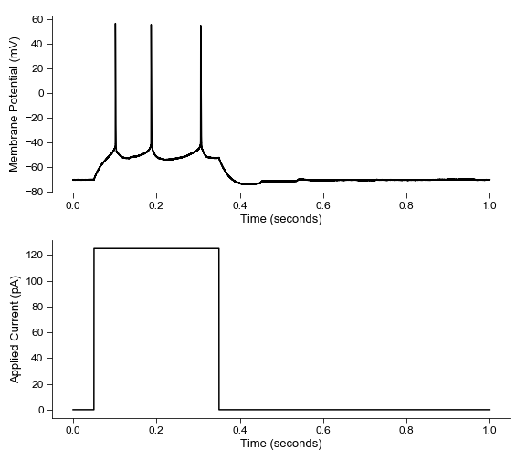
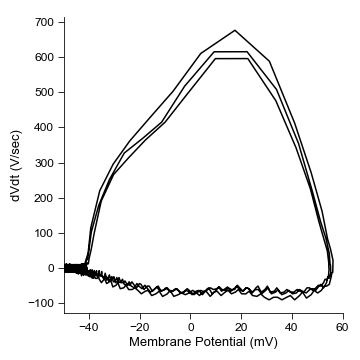
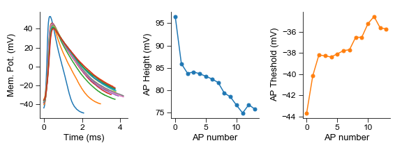

## pyibt
pyibt is a Python module that provides a simple and intuitive API for analyzing and visualizing electrophysiological data stored in IBT files generated by the ECCELES Igor Pro analysis program.

pyibt was inspired by the [pyABF module written by Scott Harden](https://github.com/swharden/pyABF) for Axon Binary Format (ABF) files.

### Loading data
```python
from pyibt import read_ibt
ibt = read_ibt('demo.ibt')
```

### Accessing file information
```python
print('ibt file name:', ibt.name)
print('Number of sweeps:', len(ibt.sweeps))
```
```
ibt file name: demo
Number of sweeps: 28
```

### Accessing sweep data
```python
sweep = ibt.sweeps[0]
print('Recording mode:', sweep.rec_mode)
print('Sweep data:', sweep.data)
print('Recording mode:', sweep.y_label)
print('Sweep time:', sweep.time)
print('Recording mode:', sweep.x_label)
print('Sweep command:', sweep.command)
```
```
Recording mode: current clamp
Sweep data: [-63.18666667 -62.98666667 -62.89333333 ... -62.98666667 -62.98666667 -63.18666667]
Recording mode: Membrane Potential (mV)
Sweep time: [0.0000e+00 2.0000e-05 4.0000e-05 ... 9.9994e-01 9.9996e-01 9.9998e-01]
Recording mode: Time (seconds)
Sweep command: [0. 0. 0. ... 0. 0. 0.]
```

### Quick plot functions
```python
fig = plt.figure(figsize=(8, 7))
ax1 = fig.add_subplot(211)
ax1 = ibt.plot_sweep(sweep_num=16, ax=ax1)

ax2 = fig.add_subplot(212)
ax2 = ibt.plot_command(sweep_num=16, ax=ax2)
```

```python
fig = plt.figure(figsize=(5, 5))
ax=ibt.plot_sweep_phase_plane(sweep_num=16)
ax.set_xlim(-50, 60)
```

```python
fig=plt.figure(figsize=(8,5))
ax=ibt.plot_all_sweeps()
```

### Get Creative
```python
sweeps = ibt.sweeps[9:25]
cm = plt.get_cmap("winter")
colors = [cm(i/len(sweeps)) for i, x in enumerate(sweeps)]

plt.figure(figsize=(12, 8))
for i, sweep in enumerate(sweeps):
    num_pnts = int(0.5/sweep.dx)
    x = sweep.time[:num_pnts] + 0.02 * i
    y = sweep.data[:num_pnts] + 10 * i
    plt.plot(x, y, color=colors[i], alpha=0.5)
plt.gca().axis('off')
```


### Automatic detection of action potentials
```Python
command = 4
sweeps = ibt.sweeps[9:25]

num_APs = []
current = []
for sweep  in sweeps:
    num_APs.append(len(sweep.spike_times_during_command(command)))
    current.append(sweep.commands[4]['value'])

fig=plt.figure(figsize=(8, 5))
plt.plot(current, num_APs, '-o', markersize=10)
plt.ylabel('Number of Action potentials')
plt.xlabel('Applied current (pA)')
plt.savefig('example_plots/FI_curve.png')
```


```Python
sweep = ibt.sweeps[25]
spikes = sweep.spike_properties()

spike_num = [x for x in range(len(spikes))]
spike_height = [spike['height'] for spike in spikes]
spike_thresh = [spike['thresh'] for spike in spikes]

fig = plt.figure(figsize=(8, 3))
ax1 = fig.add_subplot(131)
for spike in spikes:
    ax1.plot(spike['time'] * 1000, spike['Vm'])
ax1.set_ylabel('Mem. Pot. (mV)')
ax1.set_xlabel('Time (ms)')

ax2 = fig.add_subplot(132)
ax2.plot(spike_num,spike_height, '-o', markersize=5)
ax2.set_ylabel('AP Height (mV)')
ax2.set_xlabel('AP number')

ax3 = fig.add_subplot(133)
ax3.plot(spike_num,spike_thresh, '-o', markersize=5, color='tab:orange')
ax3.set_ylabel('AP Theshold (mV)')
ax3.set_xlabel('AP number')
```


**Details of the ibt file structure can be found** [here](docs/ibt_structure.md)
